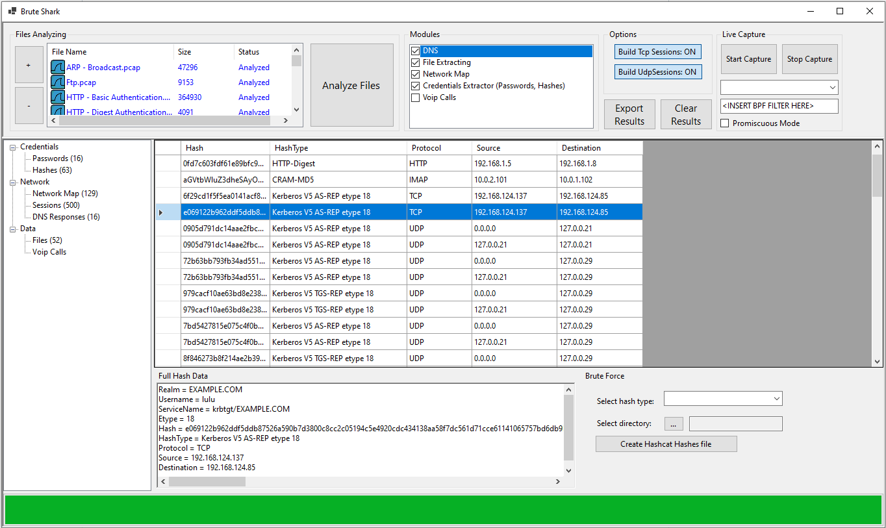
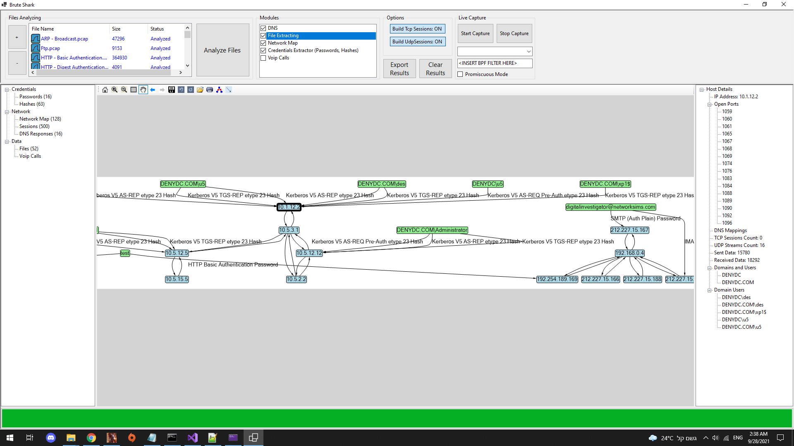
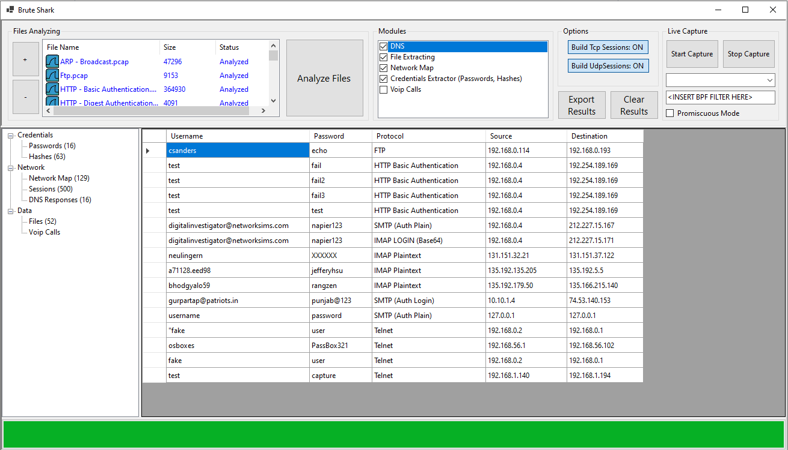

  []() [](https://www.paypal.com/cgi-bin/webscr?cmd=_s-xclick&hosted_button_id=UWUNVCJVPNTUY&source=url) [](https://twitter.com/intent/tweet?text=Check+out+Brute-shark%21+A+free+open+source+PCAP+analyzer+tool+for+security+researchers%3A+https%3A%2F%2Fgithub.com%2Fodedshimon%2FBruteShark)  
<!--ts-->
   * [About](#about)
      * [What it can do](#what-it-can-do)
      * [Download](#download)
   * [Examples](#examples)
   * [Usage](#usage)
     * [Modules](#modules)
     * [BruteSharkDesktop](#brutesharkdesktop)
     * [BruteSharkCli](#brutesharkcli)
   * [Architecture](#architecture)
   * [Contributing](#contributing)
<!--te-->
# About

BruteShark is a Network Forensic Analysis Tool (NFAT) that performs deep processing and inspection of network traffic (mainly PCAP files, but it also capable of directly live capturing from a network interface). It includes: password extracting, building a network map, reconstruct TCP sessions, extract hashes of encrypted passwords and even convert them to a Hashcat format in order to perform an offline Brute Force attack.

The main goal of the project is to provide solution to security researchers and network administrators with the task of network traffic analysis while they try to identify weaknesses that can be used by a potential attacker to gain access to critical points on the network.

Two BruteShark versions are available, A GUI based application (Windows) and a Command Line Interface tool (Windows and Linux).  
The various projects in the solution can also be used independently as infrastructure for analyzing network traffic on Linux or Windows machines. For further details see the Architecture section.

The project was developed in my spare time to address two main passions of mine: software architecture and analyzing network data.

I love to get feedbacks from BruteShark users, your opinion is important to me!
Feel free to contact me on <contact.oded.shimon@gmail.com> or [create new issue](https://github.com/odedshimon/BruteShark/issues).

Please ⭐️ this repository if this project helped you!
<div>
	Also, if you're feeling generous, you can buy me a coffe <a href="https://www.buymeacoffee.com/OdedShimon">
		
	</a>
</div>

## What it can do
* Extracting and encoding usernames and passwords (HTTP, FTP, Telnet, IMAP, SMTP...)
* Extract authentication hashes and crack them using Hashcat (Kerberos, NTLM, CRAM-MD5, HTTP-Digest...)
* Build visual network diagram (Network nodes & users)
* Extract DNS queries
* Reconstruct all TCP & UDP Sessions
* File Carving
* Extract Voip calls (SIP, RTP)

## Download
##### Windows 
* Prerequisites: 
    * WinPcap / Npcap driver  ([Wireshark](https://www.wireshark.org/download.html) installs one of this by default)  
    * [.NET Core Runtime](https://dotnet.microsoft.com/download/dotnet/3.1/runtime)  
* Download [Windows Installer (64 Bit)](https://github.com/odedshimon/BruteShark/releases/latest/download/BruteSharkDesktopInstaller_x64.msi).  
##### Linux
* Prerequisites: libpcap driver  
* Download [BruteSharkCli](https://github.com/odedshimon/BruteShark/releases/latest/download/BruteSharkCli) and just run it:  
    ```bash
    # Create a symbolyc link between libpcap.so and the actual libpcap file (e.g. libpcap.so.0.8)
    # That needed due to a known issue in SharpPcap (https://github.com/chmorgan/sharppcap/issues/167)
    find /usr/lib/x86_64-linux-gnu -type f | grep libpcap | head -1 | xargs -i sudo ln -s {} /usr/lib/x86_64-linux-gnu/libpcap.so
    wget https://github.com/odedshimon/BruteShark/releases/latest/download/BruteSharkCli
    ./BruteSharkCli
    ```

# Examples
##### Videos
[**How do i crack (by mistake!) Windows 10 user NTLM password**](https://youtu.be/AreguLxCCz4)  
##### Hashes Extracting

##### Building a Network Diagram

##### File Carving

##### Password Extracting

##### Reconstruct all TCP Sessions

##### Brute Shark CLI 


# Usage
In general, it is recommended load, run and explore the results.  
Example PCAP files containing scenarios that demonstrates all BruteShark capabilities can be downloaded from [here](https://github.com/odedshimon/BruteShark/tree/master/Pcap_Examples).  
Note that analyzing network traffic is an operation that consumes time and resources, so it is recommended to select only the required modules when large files are loaded.  
Particular attention should be paid to the "Build TCP Sessions" / "Build UDP Sessions" options.  
## Modules
BruteShark is a modular tool, designed for expansion.
##### Credentials Module 
This module is responsible for extracting and encoding usernames and passwords as well as authentication hashes. In fact this module is responsible for updating two display tables, passwords table and hashes table. While usernames and passwords are straight forward to use, hashes most often used in more complex attacks like pass-the-hash or by brute-forcing them to get the password. BruteShark is integrated with [Hashcat](https://hashcat.net/hashcat/) so all the hashes extracted can be converted to a Hashcat input file.
| Protocol        | Hash Type        | Hascat Mode (-m) |
|-----------------|------------------|------------------|
| HTTP            | HTTP-Digest      |      11400       |
| SMTP\IMAP       | CRAM-MD5         |      16400       |
| NTLM (e.g. SMB) | NTLMv1           |      5500        |
| NTLM (e.g. SMB) | NTLMv2           |      5600        |
| Kerberos        | AS-REQ etype 23  |      7500        |
| Kerberos        | TGS-REP etype 23 |      13100       |
| Kerberos        | AS-REP etype 23  |      18200       |
##### Network Map Module 
This module is responsible for building the network map by identifying components in the network and the connections between them. The network map can be exported to JSON format for analysis with external tools such as [Neo4j](https://neo4j.com/).  
  
##### Files Extracting Module  
This module tries to extract files from UDP / TCP sessions (Therefore, note that in order for this module to be effective, the "Build TCP Sessions" / "Build UDP Sessions" should be turn on). Currently this module supports classic forensics techniques of file carving by "Header-Footer" algorithm which is effective for files with known file header and footer like JPG, PNG, PDF.
##### Voip Calls Module  
This module extracts Voip calls from SIP & RTP protocols. The extracted calls can be exported as raw audio files and can be played using a proper audio player (like [Audacity](https://www.audacityteam.org/))  
## BruteSharkDesktop
The GUI is pretty self-explanatory, just load the wanted files, configure the wanted modules and press the run button.
## BruteSharkCli
BruteSharkCli is the cli version of BruteShark for Linux users (It can also compiled for Windows operating systems). It has all the features of BruteSharkDesktop and designed to operate from a shell.
As a classic cli tool it works by geting all the relevant parameters for the processing and then printing the results to stdout or files.

Print the help menu:  

    BruteSharkCli>BruteSharkCli --help

Get credentials from all files in a directory (passwords and hashes will be printed to stdout): 
  
     BruteSharkCli -m Credentials -d "C:\Users\King\Desktop\Pcap Files"

Get credentials from all files in a directory and also export extracted hashes (if found) to a Hashcat input files.  
    
     BruteSharkCli -m Credentials -d C:\Users\King\Desktop\Pcap_Examples -o C:\Users\King\Desktop\Results
    
Run multiple modules on all files in a directory and also export all the results.  
    
     BruteSharkCli -m Credentials,NetworkMap,FileExtracting -d C:\Users\King\Desktop\Pcap_Examples -o C:\Users\King\Desktop\Results
     
Sniff an interface named "Wi-Fi", run multiple modules and also export all the results to a directory (the results will be exported only when stoping the sniffer by hitting CTRL + C).

    BruteSharkCli -l Wi-Fi -m Credentials,NetworkMap,FileExtracting,DNS -o C:\Users\King\Desktop\Test Export

# Architecture
All BruteShark projects are implemented using `.Net Core` and `.Net Standard` for modern and cross platform support.
The solution is designed with three layer architecture, including a one or more projects at each layer - DAL, BLL and PL.
The separation between layers is created by the fact that each project refers only its own objects.
##### PcapProcessor (DAL)
As the Data Access Layer, this project is responsible for reading raw PCAP files using appropriate drivers (WinPcap, libpcap) and the amazing wrapper library [SharpPcap](https://github.com/chmorgan/sharppcap) by Chris Morgan.
Can analyze a list of files at once, and provides additional features like reconstruction of all TCP Sessions (using the awesome project TcpRecon).
##### PcapAnalyzer (BLL)
The Business Logic Layer, responsible for analyzing network information (packet, TCP Session etc.), implements a pluggable mechanism.
Each plugin is basically a class that implements the interface *IModule*. All plugins are loaded using reflection:
```csharp
private void _initilyzeModulesList()
{
    // Create an instance for any available modules by looking for every class that 
    // implements IModule.
    this._modules = AppDomain.CurrentDomain.GetAssemblies()
                    .SelectMany(s => s.GetTypes())
                    .Where(p => typeof(IModule).IsAssignableFrom(p) && !p.IsInterface)
                    .Select(t => (IModule)Activator.CreateInstance(t))
                    .ToList();

    // Register to each module event.
    foreach(var m in _modules)
    {
        m.ParsedItemDetected += (s, e) => this.ParsedItemDetected(s, e);
    }
    
}
```
##### BruteSharkDesktop (PL)
Desktop application for Windows based on WinForms.
Uses a cross-cutting project by the meaning it referrers both the DAL and BLL layers.
This is done by composing each of the layers, register to their events, when event is triggered, cast the event object to the next layer equivalent object, and send it to next layer.
```csharp
public MainForm()
{
    InitializeComponent();

    _files = new HashSet<string>();

    // Create the DAL and BLL objects.
    _processor = new PcapProcessor.Processor();
    _analyzer = new PcapAnalyzer.Analyzer();
    _processor.BuildTcpSessions = true;

    // Create the user controls. 
    _networkMapUserControl = new NetworkMapUserControl();
    _networkMapUserControl.Dock = DockStyle.Fill;
    _sessionsExplorerUserControl = new SessionsExplorerUserControl();
    _sessionsExplorerUserControl.Dock = DockStyle.Fill;
    _hashesUserControl = new HashesUserControl();
    _hashesUserControl.Dock = DockStyle.Fill;
    _passwordsUserControl = new GenericTableUserControl();
    _passwordsUserControl.Dock = DockStyle.Fill;

    // Contract the events.
    _processor.TcpPacketArived += (s, e) => _analyzer.Analyze(Casting.CastProcessorTcpPacketToAnalyzerTcpPacket(e.Packet));
    _processor.TcpSessionArived += (s, e) => _analyzer.Analyze(Casting.CastProcessorTcpSessionToAnalyzerTcpSession(e.TcpSession));
    _processor.FileProcessingStarted += (s, e) => SwitchToMainThreadContext(() => OnFileProcessStart(s, e));
    _processor.FileProcessingEnded += (s, e) => SwitchToMainThreadContext(() => OnFileProcessEnd(s, e));
    _processor.ProcessingPrecentsChanged += (s, e) => SwitchToMainThreadContext(() => OnProcessingPrecentsChanged(s, e));
    _analyzer.ParsedItemDetected += (s, e) => SwitchToMainThreadContext(() => OnParsedItemDetected(s, e));
    _processor.TcpSessionArived += (s, e) => SwitchToMainThreadContext(() => OnSessionArived(Casting.CastProcessorTcpSessionToBruteSharkDesktopTcpSession(e.TcpSession)));
    _processor.ProcessingFinished += (s, e) => SwitchToMainThreadContext(() => OnProcessingFinished(s, e));

    InitilizeFilesIconsList();
    this.modulesTreeView.ExpandAll();
}
```
# Contributing
First off, thanks for taking the time to contribute! BruteShark welcomes contributions from everyone.

When contributing to this repository, please first discuss the change you wish to make via issue or
an email before making a change.

## How Can You Contribute?
- Implemening new features from [BruteShark Issues](https://github.com/odedshimon/BruteShark/issues), look for "good first isuue" and "help wanted" labels.
- Uploading example PCAP files, especially files, with interesting content.
- Proposing new features by [Creating an Issue](https://github.com/odedshimon/BruteShark/issues).
- Reporting a bug by [Creating an Issue](https://github.com/odedshimon/BruteShark/issues).
- Discussing the current state of the code.
- Creating videos and example tutorials of using BruteShark.
